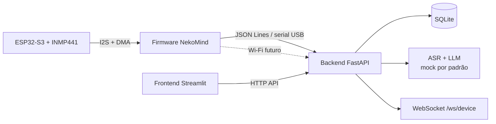

# NekoMind

Sistema embarcado de apoio ao estudo baseado na **técnica Feynman**: o
estudante explica um conceito em voz alta, o NekoMind captura o áudio
(ESP32-S3 + INMP441), transcreve, extrai tópicos e calcula métricas de
clareza e abrangência — tudo apresentado em um dashboard lúdico.

## Propósito

Transformar a técnica Feynman em um ciclo rápido e visível:

1. O aluno fala sua explicação para o dispositivo (avatar "gatinho").
2. O firmware envia o áudio ao computador (serial USB; Wi-Fi no futuro).
3. O backend transcreve (ASR), extrai tópicos (LLM) e calcula métricas.
4. O dashboard mostra a evolução das explicações.

> ⚠️ **Importante**
> O processamento por IA deve ser tratado como apoio à reflexão do estudante,
> não como avaliação pedagógica definitiva. Métricas de clareza e abrangência
> são heurísticas e devem ser apresentadas como estimativas.

## Arquitetura (visão geral)



Mais detalhes em [`docs/architecture.md`](docs/architecture.md).

## Pré-requisitos

- **Python 3.11+** (backend e frontend);
- **Git**;
- (Opcional para firmware) **ESP-IDF** instalado pelo próprio projeto
  (`scripts/setup_espidf_portable.sh`) e **VS Code portátil**;
- Hardware (para gravar de verdade): ESP32-S3, microfone INMP441, LCD.

## Estrutura

```
nekomind/
├── iot/nekomind_firmware/   firmware ESP-IDF (ESP32-S3)
├── backend/                 FastAPI + SQLite + ASR/LLM
├── frontend/streamlit/      dashboard (Streamlit)
├── docs/                    requisitos, arquitetura, protocolo, DER
├── scripts/                 setup e execução (.sh e .ps1)
├── esp-idf/ e tools/        ESP-IDF e toolchains (gerados, não versionados)
└── vscode-portable/         VS Code portátil (gerado, não versionado)
```

## Setup

### 1. Backend e frontend (Python)

```bash
# Linux/macOS
bash scripts/setup_backend.sh
bash scripts/setup_frontend.sh
# Windows (PowerShell)
.\scripts\setup_backend.ps1
.\scripts\setup_frontend.ps1
```

### 2. Firmware (opcional)

```bash
bash scripts/setup_espidf_portable.sh   # baixa ESP-IDF + toolchains em ./esp-idf e ./tools
source scripts/source_idf.sh
cd iot/nekomind_firmware
idf.py set-target esp32s3
idf.py build
```

### 3. VS Code portátil

Ver [`vscode-portable/README.md`](vscode-portable/README.md) e
`scripts/launch_vscode.sh`/`.ps1`.

## Execução

```bash
# Tudo (backend + frontend):
bash scripts/run_all.sh            # ou .\scripts\run_all.ps1
# Separadamente:
bash scripts/run_backend.sh        # http://127.0.0.1:8000
bash scripts/run_frontend.sh       # http://127.0.0.1:8501
# Testes:
bash scripts/run_tests.sh          # pytest do backend
```

## Comandos úteis

| Ação | Linux/macOS | Windows |
|---|---|---|
| Setup backend | `bash scripts/setup_backend.sh` | `.\scripts\setup_backend.ps1` |
| Setup frontend | `bash scripts/setup_frontend.sh` | `.\scripts\setup_frontend.ps1` |
| Setup ESP-IDF | `bash scripts/setup_espidf_portable.sh` | `.\scripts\setup_espidf_portable.ps1` |
| Rodar tudo | `bash scripts/run_all.sh` | `.\scripts\run_all.ps1` |
| Testes | `bash scripts/run_tests.sh` | `.\scripts\run_tests.ps1` |
| Abrir VS Code | `bash scripts/launch_vscode.sh` | `.\scripts\launch_vscode.ps1` |

## Limitações do MVP

- **ASR e LLM em modo mock**: sem chaves de API e sem baixar modelos;
  transcrições e tópicos são dados fictícios marcados como `[DEMO]`.
- **Firmware simulado**: captura I2S e LCD por logs até os pinos serem
  definidos (ver TODOs nos headers em `iot/nekomind_firmware/main/`).
- **Transporte serial no MVP**: a ingestão real pelo dispositivo ainda
  será ligada; por ora os uploads ocorrem via API (multipart) ou WebSocket.
- **SQLite** como banco padrão (PostgreSQL planejado).
- Métricas de clareza/abrangência são **heurísticas** de demonstração.

## Licença

MIT — ver [LICENSE](LICENSE).