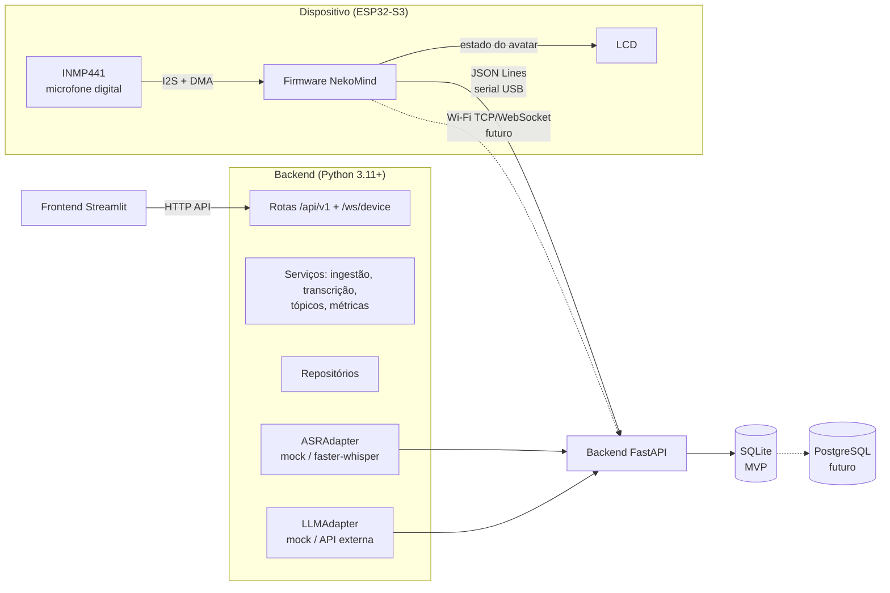
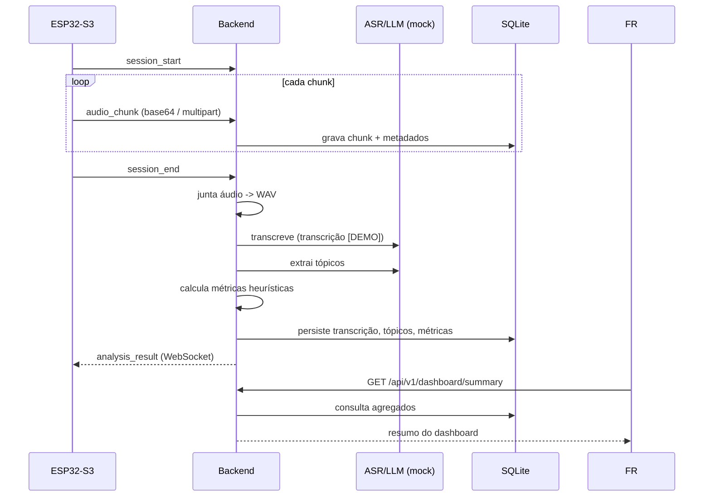

# Arquitetura do NekoMind

## Visão geral

## Fluxo de uma sessão

## Componentes

### IoT (firmware)

- `main/nekomind_main.c` — ponto de entrada;
- `session_controller` — máquina de estados da sessão;
- `audio_capture` — buffer circular de chunks PCM;
- `i2s_microphone` — driver INMP441 (I2S + DMA);
- `audio_transport` — serial JSON Lines (Wi-Fi planejado);
- `avatar_state` — estados IDLE/RECORDING/SENDING/PROCESSING/SUCCESS/ERROR;
- `display_ui` — renderização do avatar no LCD (ou log no MVP).

Protocolo: [`docs/iot_protocol.md`](iot_protocol.md).

### Backend

Camadas isoladas:

| Camada | Pasta | Responsabilidade |
|---|---|---|
| API | `app/api/` | rotas e validação (Pydantic) |
| Serviços | `app/services/` | casos de uso |
| Repositórios | `app/repositories/` | acesso ao banco |
| Banco | `app/database/` | engine, modelos, sessões |
| Adaptadores | `app/adapters/` | serial, Wi-Fi, ASR, LLM |
| Schemas | `app/schemas/` | contratos de entrada/saída |

Decisões:

- **SQLite por padrão** (arquivo local, zero setup); troca por PostgreSQL
  é só mudar `NEKOMIND_DATABASE_URL`.
- **Adapters substituíveis**: `MockASRAdapter`/`MockLLMAdapter` (padrão,
  offline) com pontos de extensão para faster-whisper e APIs de LLM.
- **Métricas heurísticas** em `services/clarity_evaluation.py`, cada uma
  documentada e explicável.

### Frontend

- Streamlit; consumo exclusivamente via `services/backend_client.py`.
- Páginas: Dashboard, Sessões, Tópicos, Configurações.

## Segurança e configuração

- Chaves de API apenas via `.env` (nunca versionado).
- Configurações centralizadas em `backend/app/config.py` (prefixo
  `NEKOMIND_`).

## Limitações do MVP

- ASR/LLM em modo mock (dados `[DEMO]`).
- Firmware com captura e LCD simulados.
- Serial ainda não conectada ao backend (upload via API/WebSocket).
- Sem autenticação (uso local/didático).