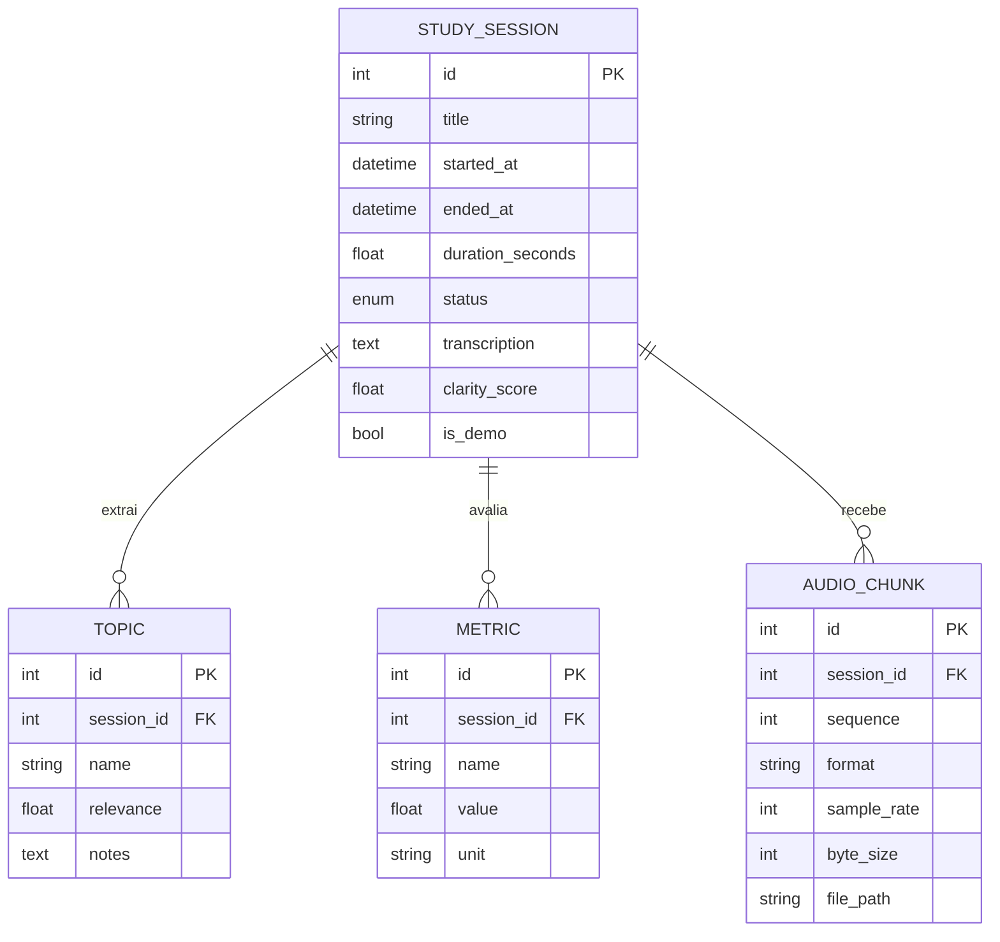

# Modelo de dados

## Entidades

## Descrição

- **StudySession**: uma explicação gravada. `status` em
  `recording | processing | completed | error`. `clarity_score` (0..10)
  é uma heurística de demonstração.
- **Topic**: conceito extraído da transcrição. `relevance` em 0..1 e
  `notes` (observações do LLM/reflexão).
- **Metric**: métricas calculadas por sessão (`duration_seconds`,
  `word_count`, `topic_count`, `lexical_diversity`, `topic_coverage`,
  `clarity_score`), cada uma com `value` + `unit`.
- **AudioChunk**: metadados de cada bloco de áudio recebido; o payload
  bruto fica em disco (`storage/audio/session_<id>/chunk_<seq>.raw`),
  referenciado por `file_path`.

## Por que SQLite no MVP?

1. **Zero configuração**: arquivo local, sem servidor nem credenciais —
   ideal para um trabalho acadêmico e para rodar em qualquer máquina.
2. **Portabilidade**: o banco viaja com o projeto (útil para entrega).
3. **Camada de acesso única**: o código usa SQLAlchemy; trocar para
   PostgreSQL é apenas alterar `NEKOMIND_DATABASE_URL`
   (`postgresql+psycopg://...`). Nenhuma mudança em repositórios/modelos.
4. **Carga baixa**: dados de um único estudante em uma única máquina.

## Migrações

No MVP as tabelas são criadas em `init_db()` (startup) via
`Base.metadata.create_all`. Para evoluir o schema, `database/migrations/`
é o local dos scripts (futuro: Alembic).

## Banco de dados de dados locais

O arquivo SQLite com dados locais fica em `backend/storage/` e é
ignorado pelo Git (ver `.gitignore`).